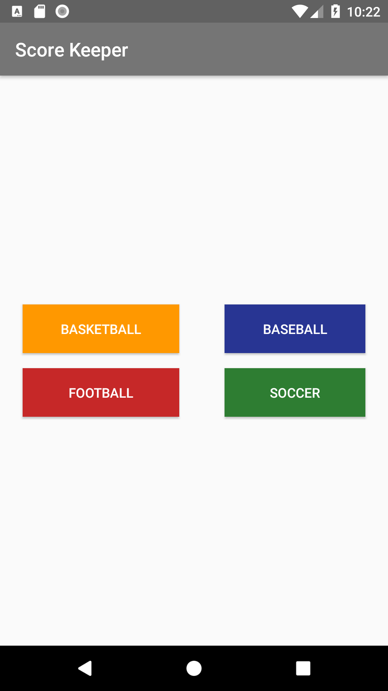
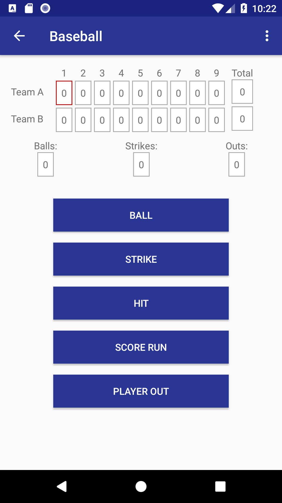

# CourtCounter
This is a score counter app, Project 2 of the Grow With Google Challenge Scholarship - Android Basics

Here is my take on this project. In addition to the project requirements I’ve added the following features:

<ul>
<li>Main Activity lets you choose from Basketball, Baseball, Football, or Soccer</li>
<li>Each sport has its own color scheme.</li>
<li>Each sport has its Reset button hidden in the Action Bar as a sub-menu to prevent accidental clicking.</li>
<li>Basketball and Soccer are similar to the example project and project requirements, having two sets of buttons - one for each team.</li>
<li>Football mode has the concept of “Possession”, eliminating the need for two sets of buttons.</li>
<li>Baseball mode features a full scoreboard showing all 9 innings.</li>
<li>Also in this mode 3 Strikes give you an Out, and 3 Outs advance the game to the next Inning.</li>
<li>Baseball mode lets you manually go to the next Inning or the previous Inning via a custom Action Bar menu.</li>
</ul>

 

